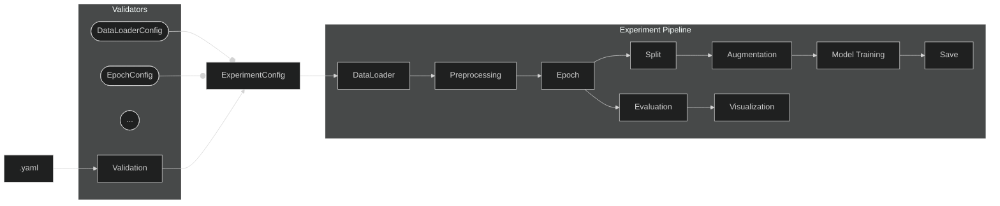

# TSP 1/2

# Orchestrace

## Diagram pipeline

## Kroky pipeline
 - `.yaml` - struktura konfiguračních souborů (zpracovány knihovnou `hydra`)
 - `Validate` - validace konfiguračních souborů (využití `Pydantic`)
 - `DataLoader` - načtení datasetů
 - `Preprocessing` - počáteční zpracování datasetů, vyčištění od šumu apod.
 - `Epoch` - epochování, rozdělení na časové úseky měření
 - `Split` - rozdělení na trénovací, testovací data
 - `Augmentation` - augmentace, generování nových datasetů pomocí transformací
 - `Model Training` - trénování modelu
 - `Save` - uložení natrénovaných dat
 - `Evaluation` - detekce fíčur v datech
 - `Visualization` - vizualizace výsledků (gui, grafy)

## Konfigurace pipeline
Konfigurační soubory se nacházejí ve složce `config/` a jsou uloženy v hierarchické struktuře `.yaml` souborů. Kořenový konfigurační soubor `config.yaml` obsahuje reference na jednotlivé konfigurační soubory kroků pipeline. 
Při spuštění nahradí `hydra` tyto reference obsahem `.yaml` souborů (klíč = složka, hodnota = soubor). Např. pro `preprocessing: mne` uloží do klíče preprocessing obsah souboru `preprocessing/mne.yaml`.

V budoucnu bude pro každý krok existovat více různých implementací, jejichž konfigurace půjdou tímto způsobem lehce nahrazovat. Zároveň je potřeba, aby každý konfigurační soubor obsahoval jeho název, protože nahrazením hodnoty `mne` obsahem souboru ztratíme informaci o zvolení právě této implementace. Aktuálně je tato hodnota v všech souborech uložena pod klíčem `backend`.

Díky použití knihovny `hydra` se celá konfigurace při každém běhu automaticky uloží do složky `outputs/` spolu s logy z `stdout`. 

## Validace konfigurace
Validace konfigurace bude provedena pomocí knihovny `pydantic`. Ta umožňuje vytvořit "otisk" struktury `.yaml` konfigurace pomocí tříd v pythonu a automaticky umí zvalidovat:
- existenci parametrů
- datové typy
- strukturu configu
- hodnotové rozsahy
- existence vstupních souborů (`FilePath`)

Pro každou část konfiguračního souboru se tedy vytvoří třída se stejnou strukturou atributů + omezeními které je potřeba zvalidovat.

Konfiguračnímu souboru `preprocessing/mne.yaml`:
```yaml
backend: mne
l_freq: 8.0
h_freq: 30.0
notch_freq: 50.0
sampling_rate_hz: 128.0
rereference: average
```
Odpovídá třída `PreprocessingConfigMNE`:
```py
class PreprocessingConfigMNE(AStageConfig):
    _target_class = "impl.epoch_preprocessing.dummy_preprocessing.DummyPreprocessing"

    backend: Literal["mne"]
    l_freq: float = Field(ge=0)
    h_freq: float = Field(ge=0)
    notch_freq: float | None
    sampling_rate_hz: float | None
    rereference: str | None
```
Na základě atributu `backend` dokáže `pydantic` automaticky detekovat která z implementací je aktuálně v konfiguraci, a zvaliduje jí podle správné třídy. V kořenové konfiguraci `ExperimentConfig` jsou nadefinované atributy pro každý krok pipeline s výčtem možností implementací.

Např. u kroku augmentace jsou přípustné 2 implementace - basic a none. Implementace je vybrána na základě klíče `backend`:
```py
augmentation: Union[AugmentationConfigBasic, AugmentationConfigNone] = Field(discriminator="backend")
```
Po vytvoření celé struktury konfigurace je potřeba pouze zvalidot kořenovou konfiguraci `ExperimentConfig` a všechny její části se "rekurzivně" zvalidují. Tento krok zajišťuje třída `ExperimentConfigValidator`, která navíc při chybě validace poskytuje list `ValidationMessage`, které popisují chybné/chybějící části konfigurace.

---
Kromě atributů shodných se vstupními `.yaml` konfiguracemi obsahují třídy s konfigurací i atribut `_target_class`. Ten obsahuje cestu k třídě, kterou konfiguruje jako řetězec (k zamezení cyclic dependencies). Po zvalidování konfigurace z ní jde jednoduše vytvořit instance třídy `_target_class` pomocí metody `AStageConfig.get_instance()` a není potřeba žádné další složité logiky (přiřazování správné třídy k danému configu).

## Implementace kroků pipeline
Jak už bylo zmíněno, každý krok pipeline může mít více implementací (pro různé knihovny různé implementace). Druh implementace/knihovny bude vybrán v `config.yaml`. Jednotlivé implementace (`src/impl/*`) implementují rozhraní daného kroku (`src/types/interfaces`), díky čemuž se dají jednoduše nahrazovat.

Jednoduchý příklad implementace DataLoaderu - načítání vstupních dat:
```py
class DummyLoader(IDataLoader):
    def run(self, input_dto: DatasetConfig, run_ctx: RunContext) -> StepResult[RawDataDTO]:
        # ... načtení souborů ...
        return StepResult(foo, bar, [])
```


## Přenos dat mezi kroky pipeline
Pro přenos dat z výstupu jednoho kroku na vstup následujícího kroku jsou využívány DTO - *data transfer objects* (viz `src/types/dto`). Každý krok má tedy nadefinovanou strukturu vstupních dat (DTO), kterou přebírá při spuštění.

## Běh pipeline
Celou *orchestraci* zajišťuje třída `ExperimentPipeline`, která postupně spouští kroky pipeline, vytváří DTO a předává je následujícím krokům.

V metodě `run()` přebírá již výše zmíněný `ExperimentConfig` a **instance všech kroků pipeline**. Dále zajišťuje i správné spouštění kroků na základě módu, ve kterém je pipeline spuštěna (training, experiment).
