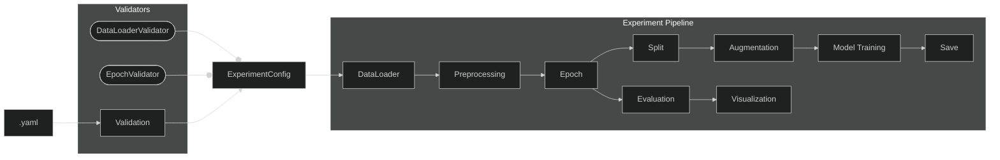

# TSP 1/2

# Orchestrace

## Diagram pipeline

## Kroky pipeline
 - `.yaml` - struktura konfiguračních souborů (zpracovány knihovnou `hydra`)
 - `Validate` - validace konfiguračních souborů (využití `Pydantic`)
 - `DataLoader` - načtení datasetů
 - `Preprocessing` - počáteční zpracování datasetů, vyčištění od šumu apod.
 - `Epoch` - epochování, rozdělení na časové úseky měření
 - `Split` - rozdělení na trénovací, testovací data
 - `Augmentation` - augmentace, generování nových datasetů pomocí transformací
 - `Model Training` - trénování modelu
 - `Save` - uložení natrénovaných dat
 - `Evaluation` - detekce fíčur v datech
 - `Visualization` - vizualizace výsledků (gui, grafy)

## Konfigurace pipeline
Konfigurační soubory se nacházejí ve složce `config/` a jsou uloženy v hierarchické struktuře `.yaml` souborů. Kořenový konfigurační soubor – `config.yaml` obsahuje reference na jednotlivé konfigurační soubory kroků pipeline. 
Při spuštění nahradí `hydra` tyto reference obsahem `.yaml` souborů (klíč = složka, hodnota = soubor). Např. pro `preprocessing: mne` uloží do klíče preprocessing obsah souboru `preprocessing/mne.yaml`.

V budoucnu bude pro každý krok existovat více různých implementací, jejichž konfigurace půjdou tímto způsobem lehce nahrazovat. Zároveň je potřeba, aby každý konfigurační soubor obsahoval jeho název, protože nahrazením hodnoty `mne` obsahem souboru ztratíme informaci o zvolení právě této implementace. Aktuálně je tato hodnota v všech souborech uložena pod klíčem `backend`.

Díky použití knihovny `hydra` se celá konfigurace při každém běhu automaticky uloží do složky `outputs/` spolu s logy z `stdout`. 

## Validace konfigurace
Pro každou část konfiguračního souboru bude zvolen správný **validátor** podle klíče `backend`. 

Pro každou část pipeline vytvoříme validátor (`DataLoaderValidator, PreprocessingValidator`), předáme mu vstupní `.yaml` a ten nám vrátí instanci obalovací třídy se zvalidovanou konfigurací daného kroku (`DataLoaderConfig, PreprocessingConfig`). Validátory budou využívat knihovnu `Pydantic`a budou kontrolovat:
- existenci parametrů
- datové typy
- strukturu configu
- hodnotové rozsahy
- existence vstupních souborů

 Konfigurace všech kroků se uloží do instance třídy `ExperimentConfig`, která se předává do pipeline při spuštění experimentu. `ExperimentConfig` tedy obsahuje **zvalidovanou konfiguraci** pro všechny kroky pipeline.

## Implementace kroků pipeline
Jak už bylo zmíněno, každý krok pipeline může mít více implementací (pro různé knihovny různé implementace). Druh implementace/knihovny bude vybrán v `config.yaml`. 

Specifické implementace kroků pipeline (`src/impl/*`) implementují rozhraní daného kroku (`src/types/interfaces`).

Jednoduchý příklad implementace DataLoaderu - načítání vstupních dat:
```py
class DummyLoader(IDataLoader):
    def run(self, input_dto: DatasetConfig, run_ctx: RunContext) -> StepResult[RawDataDTO]:
        # ... načtení souborů ...
        return StepResult(foo, bar, [])
```
Díky využití rozhraní pro každý krok samotná pipeline pracuje pouze s nimi a implementace se dají jednoduše nahraozovat.

## Přenos dat mezi kroky pipeline
Pro přenos dat z výstupu jednoho kroku na vstup následujícího kroku jsou využívány DTO - *data transfer objects* (viz `src/types/dto`). Každý krok má tedy nadefinovanou strukturu vstupních dat (DTO), kterou přebírá při spuštění.

## Běh pipeline
Celou *orchestraci* zajišťuje třída `ExperimentPipeline`, která postupně spouští kroky pipeline, vytváří DTO a předává je následujícím krokům.

V metodě `run()` přebírá již výše zmíněný `ExperimentConfig` a **instance všech kroků pipeline**. Instance bude potřeba povytvářet před během pipeline na základě hodnot `backend`.

## Implementační poznámka :)
Dynamické vytváření instancí validátorů a kroků pipeline lze zajistit pomocí hodnoty `backend`. To by šlo nejjednodušeji implementovat `dict`em, např.:
```py
validators = {
    "mne": MneValidator,
    "moabb": MoabbValidator
}
# ...
validator = validators[cfg.preprocessing.backend]()
```
`Hydra` poskytuje klíč `_target_`, pomocí kterého lze dynamicky instancovat třídu dle jeho klíče - v každém konfigu dané implementace by byla navíc cesta ke třídě, kterou konfiguruje. Např `mne.yaml`:
```yaml
implementation:
 - _target_: src.impl.preprocessing.mne.MnePreprocessor
# ...
backend: mne
l_freq: 8.0
h_freq: 30.0
```
V Pythonu by potom stačilo:
```py
preprocessor = instantiate(cfg.preprocessing.implementation)
```
Více viz https://hydra.cc/docs/advanced/instantiate_objects/overview/
